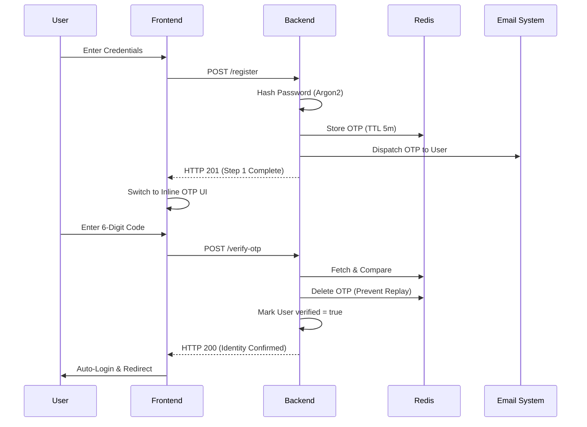
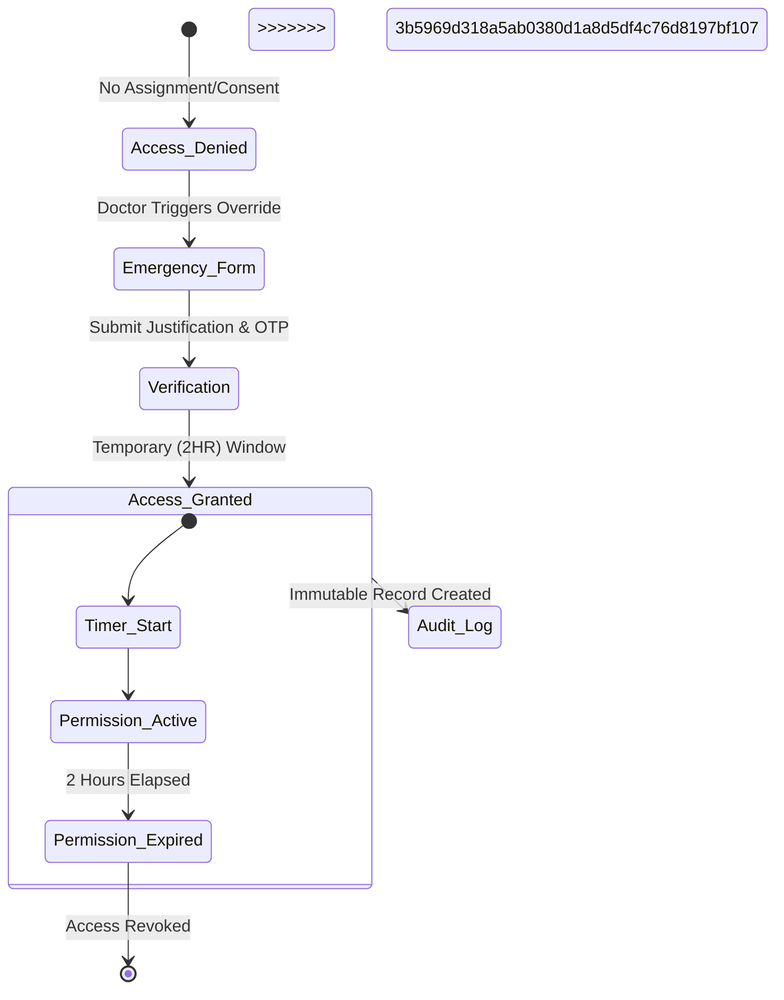
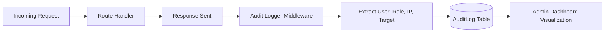

# 🛡️ MedAuth: Zero-Trust Healthcare Access Platform

Protecting sensitive medical data through strict authentication, ephemeral keys, and immutable audit trails.

---

## 🛑 The Problem: Healthcare Data Security

Modern healthcare systems suffer from **Premature Trust**. Standard applications grant wide-ranging access based on static, easily compromised passwords. When emergencies occur, rigid security protocols either lock providers out of critical patient data or, conversely, over-provision access, leading to catastrophic data breaches and HIPAA violations.

## 💡 The Solution: MedAuth

**MedAuth** is a production-grade, full-stack healthcare security platform engineered around **Zero-Trust Principles**. 

We replace static trust with dynamic, verifiable communication channels and time-bound ephemeral access. MedAuth proves identity through multi-step trust onboarding, executes authorizations via granular **ABAC (Attribute-Based Access Control)**, and provides a secure **"Break-Glass"** override for medical emergencies—ensuring privacy and availability coexist.

---

## 🏗️ System Architecture

MedAuth utilizes a decoupled client-server architecture, prioritizing separation of concerns and defense-in-depth.

<<<<<<< HEAD
### � High-Level Component Flow
```mermaid
graph TD
    subgraph Client_Space ["User Interface Layer"]
        UI[React/Vite Dashboard]
        Verify[OTP Verification In-line]
    end

    subgraph Defense_Perimeter ["Gateway & Security"]
        LR[Rate Limiter]
        Val[Zod Schema Validator]
        Auth[JWT / CASL Auth Middleware]
=======
### 🌐 High-Level Component Flow
```mermaid
graph TD
    subgraph Client_Space ["User Interface Layer (React 19)"]
        UI[Glassmorphic Dashboard]
        Verify[OTP Verification In-line]
        Modal[Global Modal/Drawer Engine]
    end

    subgraph Defense_Perimeter ["Security Gateway (Express)"]
        LR[Rate Limiter]
        Val[Zod Schema Validator]
        Auth[JWT / CASL Auth Middleware]
        Blacklist[Redis Token Blacklist]
>>>>>>> 3b5969d318a5ab0380d1a8d5df4c76d8197bf107
    end

    subgraph Service_Logic ["Business Domain"]
        AS[Auth Service]
        PS[Patient Service]
<<<<<<< HEAD
=======
        CS[Consent Manager]
>>>>>>> 3b5969d318a5ab0380d1a8d5df4c76d8197bf107
        ES[Emergency Access Handler]
    end

    subgraph Infrastructure_Layer ["Persistence & Trust"]
<<<<<<< HEAD
        DB[(PostgreSQL)]
        RD[(Redis Ephemeral Store)]
=======
        DB[(PostgreSQL / Supabase)]
        RD[(Redis Ephemeral Store)]
        Audit[(Immutable Audit Logs)]
>>>>>>> 3b5969d318a5ab0380d1a8d5df4c76d8197bf107
        SMTP[Email Trust Channel]
    end

    UI --> LR
    LR --> Val
    Val --> Auth
<<<<<<< HEAD
    Auth --> AS & PS & ES
    AS --> RD & SMTP
    PS & ES --> DB
    ES --> RD
=======
    Auth --> AS & PS & ES & CS
    AS --> RD & SMTP
    PS & ES & CS --> DB
    ES --> RD
    DB -.-> Audit
>>>>>>> 3b5969d318a5ab0380d1a8d5df4c76d8197bf107
```

---

## 🔒 Security Operations & Workflows

### 1. The Multi-Step Trust Onboarding (Inline Verification)
Verification is not an afterthought; it is the gateway. MedAuth enforces a synchronous OTP verification flow during registration to ensure every active account is backed by a verified communication channel.



### 2. Authorization Logic: CASL ABAC & RBAC
MedAuth doesn't just check roles; it checks **Attributes**.
*   **RBAC**: "Is this a Doctor?"
<<<<<<< HEAD
*   **ABAC**: "Is this Doctor assigned to this specific Patient?"
=======
*   **ABAC**: "Is this Doctor assigned to this specific Patient or has active Consent?"
>>>>>>> 3b5969d318a5ab0380d1a8d5df4c76d8197bf107

```mermaid
graph LR
    User((User)) --> Request{Resource Request}
    Request --> JWT[JWT Decryption]
<<<<<<< HEAD
    JWT --> Policy[CASL Policy Engine]
=======
    JWT --> Blacklist{Blacklist Check}
    Blacklist -->|Valid| Policy[CASL Policy Engine]
    Blacklist -->|Invalid| Deny401[401 Unauthorized]
>>>>>>> 3b5969d318a5ab0380d1a8d5df4c76d8197bf107
    
    subgraph Policy_Rules
        R1[Role Check]
        R2[Assignment Match]
<<<<<<< HEAD
        R3[Consent Check]
    end
    
    Policy --> R1 & R2 & R3
    R1 & R2 & R3 --> Dec[Decision]
=======
        R3[Consent Validation]
        R4[Emergency Override]
    end
    
    Policy --> R1 & R2 & R3 & R4
    R1 & R2 & R3 & R4 --> Dec[Decision]
>>>>>>> 3b5969d318a5ab0380d1a8d5df4c76d8197bf107
    Dec -->|Allow| Data[(Medical Records)]
    Dec -->|Deny| Error[403 Forbidden]
```

<<<<<<< HEAD
### 3. Emergency Break-Glass Workflow
In critical care, seconds count. MedAuth allows authorized staff to bypass standard assignment boundaries through a strictly audited "Break-Glass" mechanism.

```mermaid
stateDiagram-v2
    [*] --> Access_Denied: Unassigned Patient
    Access_Denied --> Emergency_Form: Doctor Triggers Override
    Emergency_Form --> Verification: Submit Justification
=======
### 3. Patient Consent Management Flow
Patients own their data. They can grant or revoke access to specific medical staff at any time.

```mermaid
sequenceDiagram
    participant P as Patient
    participant F as Frontend
    participant B as Backend
    participant D as Doctor

    P->>F: Locate Doctor in Directory
    P->>F: Click "Grant Consent"
    F->>B: POST /api/consent { staffId }
    B->>B: Verify Token & Patient Role
    B->>B: Create ACTIVE Consent Record
    B-->>F: Success
    F->>P: Visual Confirmation
    Note over D, B: Doctor can now access Patient's Full Record
    P->>F: Click "Revoke Access"
    F->>B: PATCH /api/consent { id, status: REVOKED }
    B-->>F: Access Terminated
```

### 4. Emergency "Break-Glass" Workflow
In critical care, seconds count. Authorized staff can bypass standard boundaries via a strictly audited mechanism.



<<<<<<< HEAD
=======
### 5. Automated Audit Logging Persistence
Every critical action (Login, Access, Change) is captured with full context for forensic analysis.



>>>>>>> 3b5969d318a5ab0380d1a8d5df4c76d8197bf107
---

## 🛠️ Technology Stack & Justifications

| Layer | Technology | Rationale |
| :--- | :--- | :--- |
| **Backend** | **Node.js / Express** | High concurrency for real-time telemetry. |
| **Type Safety** | **TypeScript** | Eliminates runtime authorization type errors. |
| **ORM** | **Prisma** | Deterministic, type-safe database access layer. |
| **Hashing** | **Argon2** | Industry-standard protection against GPU cracking. |
| **Validation** | **Zod** | Enforces data contract before logic execution. |
<<<<<<< HEAD
| **Cache** | **Redis** | Millisecond-level TTL enforcement for ephemeral secrets. |
| **Frontend** | **React 19 (Vite)** | Atomic component structure with instant HMR. |
| **Styling** | **Tailwind CSS** | Design system token adherence with no runtime CSS cost. |
=======
| **Cache** | **Redis** | Millisecond-level TTL enforcement and Blacklisting. |
| **Frontend** | **React 19 (Vite)** | Atomic component structure with shadcn/ui aesthetics. |
| **State** | **Zustand** | Lightweight security-focused state persistence. |
| **Styling** | **Tailwind CSS** | Premium dark-mode UI with glassmorphism. |
>>>>>>> 3b5969d318a5ab0380d1a8d5df4c76d8197bf107

---

## 📂 Project Structure
```text
/healthcare-auth-system
├── /backend
<<<<<<< HEAD
│   ├── /prisma           # DB schema & Seed (deterministic data)
│   ├── /src
│   │   ├── /modules      # Domain Logic (Auth, Emergency, Audit)
│   │   ├── /policies     # CASL ABAC Definitions
│   │   ├── /services     # Redis & SMTP Handlers
│   │   └── /middleware   # The Security Perimeter (JWT, Audit, Zod)
├── /frontend
│   ├── /src
│   │   ├── /pages        # Onboarding Portal & Dashboard
│   │   ├── /store        # Zustand Security Store
=======
│   ├── /prisma           # DB schema & Deterministic Seed
│   ├── /src
│   │   ├── /modules      # Domain Logic (Auth, Patients, Consent, Audit)
│   │   ├── /policies     # CASL ABAC Definitions
│   │   ├── /services     # Redis & SMTP Handlers
│   │   └── /middleware   # Security Perimeter (JWT, Audit, RateLimit)
├── /frontend
│   ├── /src
│   │   ├── /pages        # Onboarding Portal & Role-Specific Dashboards
│   │   ├── /store        # Zustand Secure Stores
│   │   ├── /layout       # AppLayout & Navigation
>>>>>>> 3b5969d318a5ab0380d1a8d5df4c76d8197bf107
│   │   └── /services     # Axios Security Interceptors
```

---

## 🚀 Installation & Local Development

### 1. Backend Setup
```bash
cd backend
npm install
cp .env.example .env # Configure DB, Redis, and SMTP
<<<<<<< HEAD
npx prisma db seed # Primes DB with Admin/Staff accounts
=======
npx prisma generate
npx prisma db seed # Primes DB with all demo roles
>>>>>>> 3b5969d318a5ab0380d1a8d5df4c76d8197bf107
npm run dev
```

### 2. Frontend Setup
```bash
cd ../frontend
npm install
<<<<<<< HEAD
npm run dev # Runs on locked port 5173
=======
npm run dev # Runs on port 5173
>>>>>>> 3b5969d318a5ab0380d1a8d5df4c76d8197bf107
```

---

<<<<<<< HEAD
## 🎯 The Pitch Scenario
1.  **Strict Onboarding**: Register an account. Observe the **Inline OTP** verification—no verification, no access.
2.  **Boundaries**: Log in as a Doctor. Attempt to view an unassigned patient (Blocked by ABAC).
3.  **Emergency**: Trigger **Break-Glass** with a justification. Gain instant, time-bound access.
4.  **Accountability**: Switch to Admin. View the **Audit logs** to see the immutable trail of the emergency bypass.
=======
## ☁️ Deployment

The project has been prepared for production deployment utilizing **Supabase** (PostgreSQL), **Redis Cloud**, and **Render.com**.

### 1. Backend (Render.com)
1. Commit the applied configuration updates and push to GitHub.
2. In Render, create a new **Web Service** connected to your repository.
3. Use the following build setup:
    - **Build Command**: `npm install && npm run build`
    - **Start Command**: `npm start`
4. Copy all production variables from your `.env` to Render's **Environment Variables** settings.

### 2. Frontend
Update `VITE_API_URL` within `frontend/.env.production` to point to the newly deployed backend's URL. The frontend can visually be deployed to Render as a "Static Site" or Vercel using `npm run build`.

For a comprehensive breakdown, see the [Deployment Guide](DEPLOYMENT_GUIDE.md).

---

## 🎯 The Pitch Scenario
1.  **Zero-Trust Onboarding**: Register an account. Observe the **Inline OTP** verification—no verification, no access.
2.  **Granular Boundaries**: Log in as a Doctor. Attempt to view an unassigned patient (Blocked by ABAC).
3.  **Dynamic Consent**: Log in as a Patient. Grant access to a Doctor. Re-log as Doctor to see the record now unlocked.
4.  **Emergency**: Trigger **Break-Glass** for a critical situation. Gain instant, time-bound access.
5.  **Forensics**: Switch to Admin. View the **Audit logs** to see the immutable trail of every bypass and access.
>>>>>>> 3b5969d318a5ab0380d1a8d5df4c76d8197bf107

---

## 📄 License
Licensed under the MIT License. Built for the Hackathon Stage-2 Submission.
