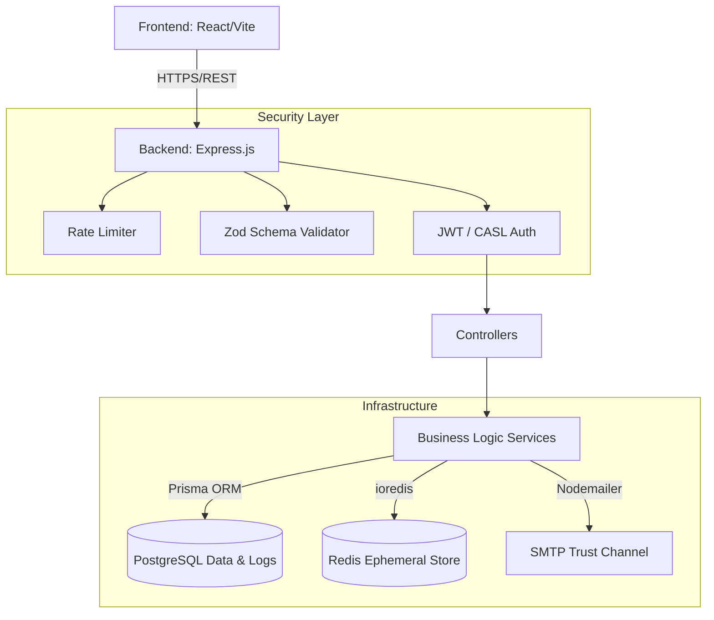

# 🛡️ MedAuth: Zero-Trust Healthcare Access Platform

Protecting sensitive medical data through strict authentication, ephemeral keys, and immutable audit trails.

---

## 🛑 The Problem: Healthcare Data Security

Modern healthcare systems suffer from premature trust. Standard applications grant wide-ranging access based on static, easily compromised passwords. When emergencies occur, rigid security protocols either lock providers out of critical patient data or, conversely, over-provision access, leading to catastrophic data breaches and HIPAA violations.

## 💡 The Solution: MedAuth

**MedAuth** is a production-grade, full-stack healthcare security platform engineered around **Zero-Trust Principles**. 

We replace static trust with dynamic, verifiable communication channels, role-based boundaries, and time-bound ephemeral access. MedAuth proves identity through multi-factor onboarding, executes authorizations via granular ABAC (Attribute-Based Access Control), and provides a secure "Break-Glass" override for medical emergencies—ensuring privacy and availability coexist.

---

## ✨ Key Differentiators & Features

*   🔐 **Multi-Factor Onboarding**: Initial registration isolates accounts in an unverified state until ownership of the email trust channel is proven via Redis-backed OTPs.
*   ✨ **Passwordless Magic Links**: Secure, frictionless authentication for patients and staff using cryptographically random, auto-expiring tokens.
*   🧠 **CASL-Powered ABAC & RBAC**: Granular permission boundaries. Doctors can only view assigned patients; Admin workflows are fiercely isolated.
*   🚑 **Emergency Break-Glass Override**: When seconds count, doctors can bypass standard assignments with a required justification, granting time-bound access that is immediately logged.
*   📜 **Immutable Audit Logging**: Every critical action—especially emergency overrides—is permanently recorded for compliance and accountability.
*   ⚡ **Ephemeral Secrets Architecture**: Redis manages the TTL (Time-To-Live) of all sensitive state (OTPs, Magic Links, Sessions), ensuring stale tokens are mathematically destroyed.

---

## 🏗️ System Architecture

MedAuth utilizes a decoupled client-server architecture, prioritizing separation of concerns and defense-in-depth.



### Component Breakdown
1.  **Frontend**: A responsive, React 19 SPA built with Vite and Tailwind CSS. It handles JWT persistence and dynamic role-based routing.
2.  **API Gateway**: Node.js/Express server acting as the secure entry point, enforcing Zod body validations and rate limits on all incoming traffic.
3.  **Database**: Supabase-hosted PostgreSQL managed via Prisma ORM for relational integrity between users, roles, patient records, and audit logs.
4.  **Ephemeral Store**: Redis handles all fast-expiring, key-value secrets (OTPs, Links) to prevent database token bloat and ensure precise TTL enforcement.

---

## 🛠️ Technology Stack & Justifications

### Backend
*   **Node.js & Express**: Provides a lightweight, non-blocking I/O model perfect for concurrent API requests.
*   **TypeScript**: Enforces strict type-safety, catching authorization typing errors at compile-time.
*   **Prisma ORM**: Offers deterministic, safe database queries and simplified migrations.
*   **Argon2**: State-of-the-art password hashing, resistant to GPU-cracking attacks.
*   **CASL**: Industry-standard isomorphic authorization library for mapping complex ABAC rules.
*   **Zod**: TypeScript-first schema declaration to guarantee input data conforms to expectations before hitting controllers.

### Frontend
*   **React (Vite)**: Lightning-fast HMR and optimized production builds.
*   **Tailwind CSS**: Utility-first styling for rapid, uniform component design.
*   **Zustand**: Minimalist, fast state management for handling complex user sessions.
*   **Axios**: Promise-based HTTP client for predictable API communication and error interception.

### Infrastructure
*   **PostgreSQL (Supabase)**: Robust ACID compliance for medical records.
*   **Redis**: In-memory data strict TTL enforcement.
*   **Gmail SMTP**: Reliable delivery vehicle for the out-of-band trust channel.

---

## 🔒 Security Operations & Logic

### 1. The Trust Channel Onboarding
Users register with standard credentials. The backend creates the user but flips `isVerified: false`. A 6-digit OTP is hashed into Redis (`expiry: 5m`) and emailed. The user must return the code. Upon success, the account is verified, and the Redis key is permanently deleted to prevent replay attacks.

### 2. Passwordless Magic Links
Users request a magic link. The backend issues a 32-byte cryptographically secure random token, mapped to the `userId` in Redis (`expiry: 10m`). The user clicks the emailed link, the backend exchanges the token for a JWT pair, and destroys the Redis mapping instantly.

### 3. JWT & Session Management
Short-lived Access Tokens (15m) are utilized for API authentication, paired with long-lived Refresh Tokens (7d) stored securely in the database to maintain seamless UX without compromising security.

### 4. Break-Glass Emergency Workflow
An unauthorized doctor attempts to access a critical patient's file. The system rejects them (`403 Forbidden`). 
The doctor initiates an Emergency Override, submitting a medical justification. The system executes the `createEmergencyAccess` transaction:
1. Grants a 2-hour temporary permission token.
2. Writes an immutable sequence to the `AuditLog` flagging the `true` override state for administrative review.

---

## 📜 Audit Traceability

Admins possess a dedicated dashboard peering into the `AuditLog` model. Every sensitive interaction captures:
*   Timestamp
*   Executing User ID & Role
*   Target Resource
*   Action Result (`SUCCESS` / `FAILURE`)
*   Emergency Context Flags

This guarantees total transparency and satisfies rigorous healthcare compliance demands.

---

## 🚀 Installation & Local Development

### Prerequisites
*   Node.js (v20+)
*   Running PostgreSQL instance (or Supabase URL)
*   Running Redis instance (or Redis Cloud URL)

### 1. Clone & Setup
```bash
git clone https://github.com/your-repo/healthcare-auth-system.git
cd healthcare-auth-system
```

### 2. Backend Initialization
```bash
cd backend
npm install

# Configure Environment
cp .env.example .env 
# Add your DATABASE_URL, REDIS_URL, JWT_SECRETS, and EMAIL_USER/PASS

# Initialize Database & Seed Roles
npx prisma generate
npx prisma migrate dev
npx prisma db seed

# Start Server
npm run dev
```

### 3. Frontend Initialization
```bash
cd ../frontend
npm install

# Start Vite 
npm run dev
```
Navigate to `http://localhost:5173`.

---

## 🛣️ API Core Routes

| Endpoint | Method | Purpose | Role Required |
| :--- | :--- | :--- | :--- |
| `/api/auth/register` | `POST` | Create new unverified account | Public |
| `/api/auth/verify-otp`| `POST` | Consume Redis OTP, verify account| Public |
| `/api/auth/login` | `POST` | Standard Password Auth | Public |
| `/api/auth/magic-link`| `POST` | Dispatch passwordless token | Public |
| `/api/auth/magic-login`|`GET` | Consume Magic Link, return JWTs| Public |
| `/api/patients` | `GET` | Retrieve assigned patient data | `DOCTOR` / `NURSE` |
| `/api/emergency` | `POST` | Trigger break-glass override | `DOCTOR` |
| `/api/admin/audit-logs`| `GET` | View global immutable logs | `ADMIN` |

---

## 📂 Project Structure
```text
/healthcare-auth-system
├── /backend
│   ├── /prisma           # DB schema and seed scripts
│   ├── /src
│   │   ├── /config       # Redis, Logger, Prisma clients
│   │   ├── /middleware   # JWT verification, Zod validation, RateLimit
│   │   ├── /modules      # Domain logic (Auth, Users, Patients, Emergency)
│   │   ├── /policies     # CASL ABAC definitions
│   │   └── /services     # Reusable SMTP and OTP handlers
│   └── e2e.ts            # Native node execution test suite
└── /frontend
    ├── /src
    │   ├── /components   # Reusable UI hooks
    │   ├── /layout       # Main application wrappers (Sidebar, Topbar)
    │   ├── /pages        # React Route elements (Login, Dashboard)
    │   ├── /services     # Axios API interceptors
    │   └── /store        # Zustand state definitions
    └── package.json      # Locked to Vite port 5173
```

---

## 🎯 The Ultimate Demo Scenario

1.  **The Zero-Trust Block**: Attempt to login with a newly registered but unverified account. The system denies access immediately.
2.  **The Trust Channel**: Check the email inbox (or backend console), retrieve the Redis OTP, and verify the account.
3.  **Passwordless Magic**: Log out completely. Request a Magic Link, and click the URL to instantly re-authenticate without a password.
4.  **The Break-Glass**: Log in as `doctor@demo.com`. Try to view unassigned patient data (Blocked). Trigger the Emergency Access form with a justification. Gain temporary 2-hour access.
5.  **The Audit Trail**: Log in as `admin@demo.com`. Review the Audit Logs to visibly see the exact timestamp and justification of the Doctor's emergency override.

---

## 🔮 Future Enhancements (Roadmap)
*   **WebAuthn Integration**: Support for hardware security keys (YubiKey) and biometric passkeys.
*   **Geofencing**: Block logins originating from IPs outside the hospital's registered network zones.
*   **FHIR Standardization**: Align patient data models with strict FHIR interoperability standards.

---

## 📄 License
This project is licensed under the MIT License - see the LICENSE file for details.
